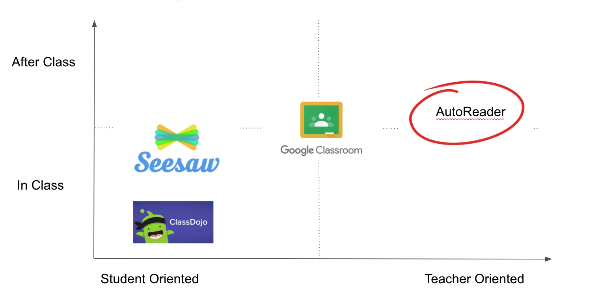
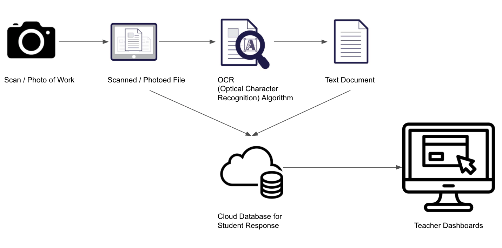
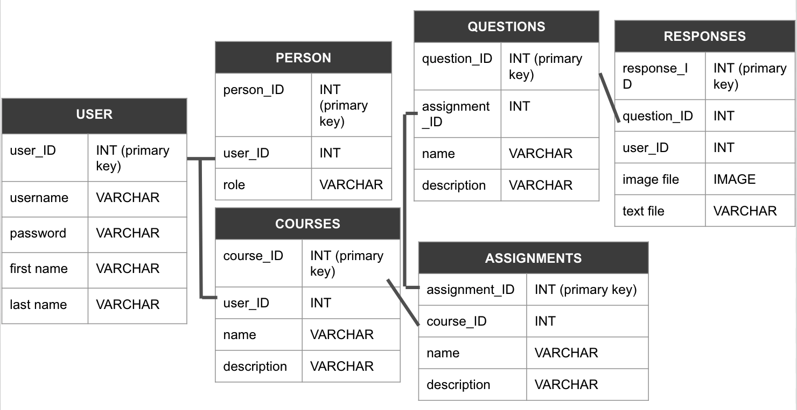

# W210 Capstone Project - AutoReader

By Allison Godfrey, Matt Kawa and Karen Liang.

## The Problem

Teachers are always busy. They continuously have 20 things on their plate at once and never the time in the workday to get them done. Much of the time outside the classroom is spent reading/evaluating student work. Many teachers struggle to read the often messy handwriting of their students, especially when trying to interpret written math equations. On aggregate, reading student handwriting adds a lot of time to a teacher’s work day outside of the classroom and we seek to limit the amount of time spent on this task.

## Goal
We seek to cut down on the time teachers spend outside of the classroom in order to maximize their focus on extending the learning of their students by making student work easier to read and interpret.

According to some preliminary research, of the time teachers spend grading student work, 40% of it is spent reading and interpreting student handwriting, while 60% is spent actually evaluating it and providing feedback.

With our product, we seek to change this time distribution to **30%-70%**.

## Target Audience
We expect our most frequent user to be **elementary school teachers** (and students).
* Their students are more likely to have handwritten assignments, since practicing handwriting is frequently part of their learning process
* Their students may not have the computer skills necessary to navigate online assignments

## Competitor Analysis
We identified a few key competitors in the market. We believe that our product can add unique values to the market that hasn't been done by the others.

## Approach
The application is consisted of two main capabilities - OCR (optimized character recognition) system and front end interactive application.

Students can scan or take a photo of their written work, upload it to the application. The work will be run through an OCR model to translate the handwritten work to formatted text. Both the original image and the formatted text will be stored in our cloud database. Teachers would have the ability to access the students work through the front end teachers dashboard.

### Modeling

### Database Schema

## [Application Link](https://github.com/allison-godfrey/capstone-project)
